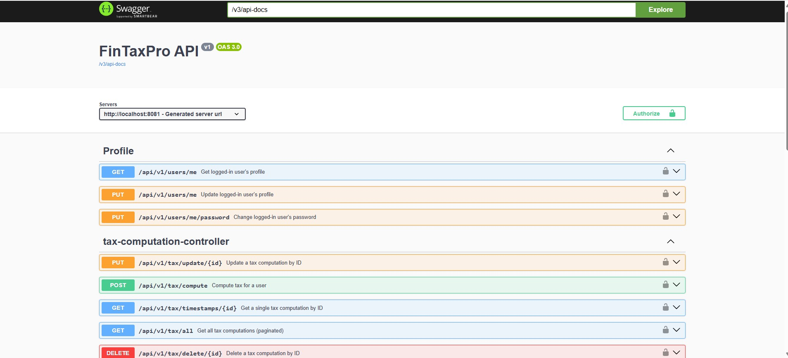
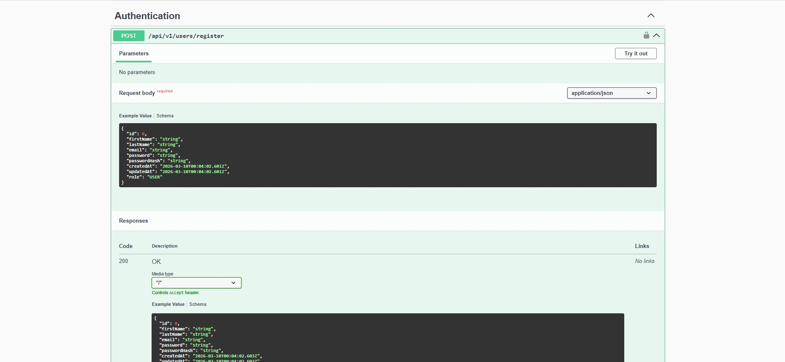
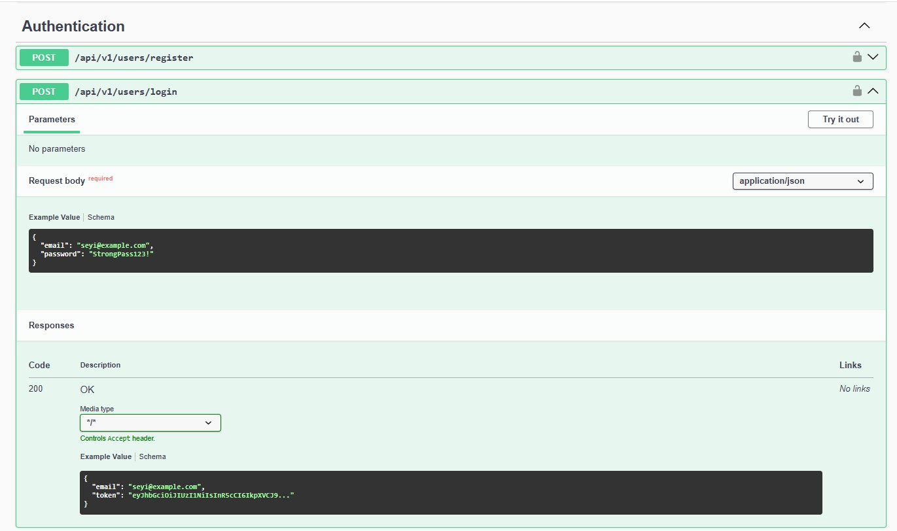
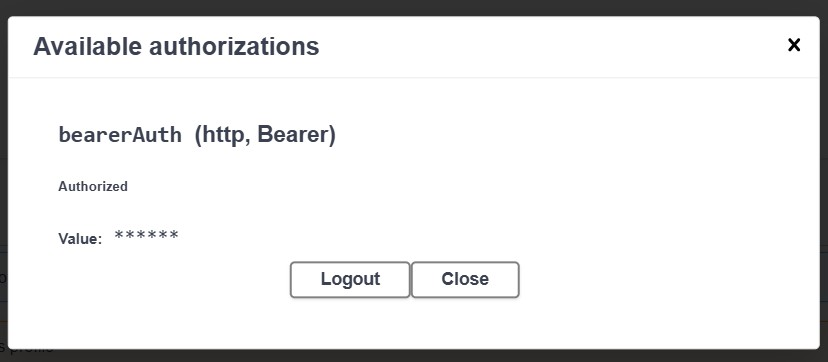
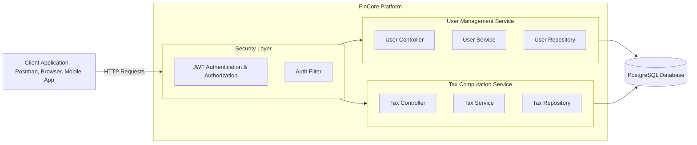
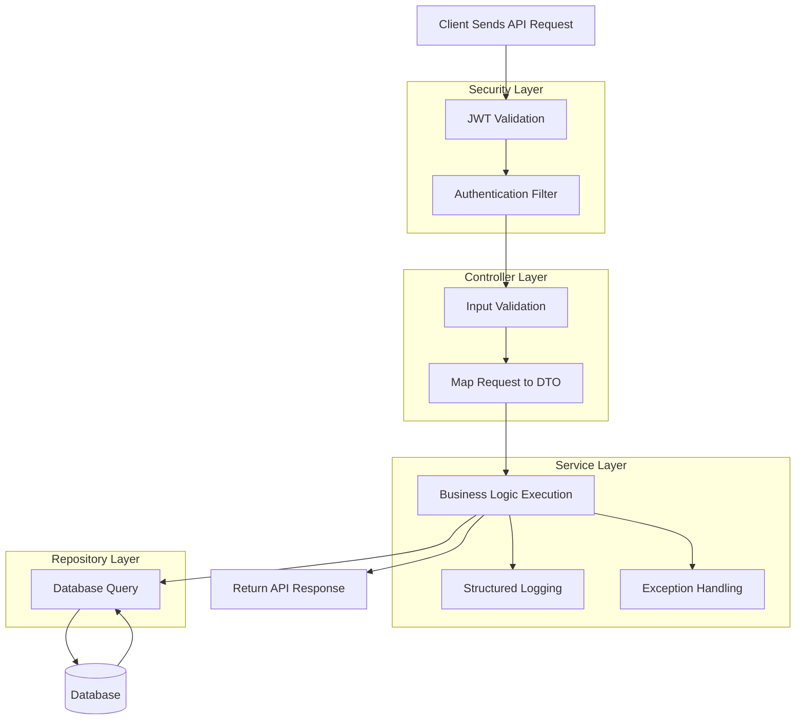
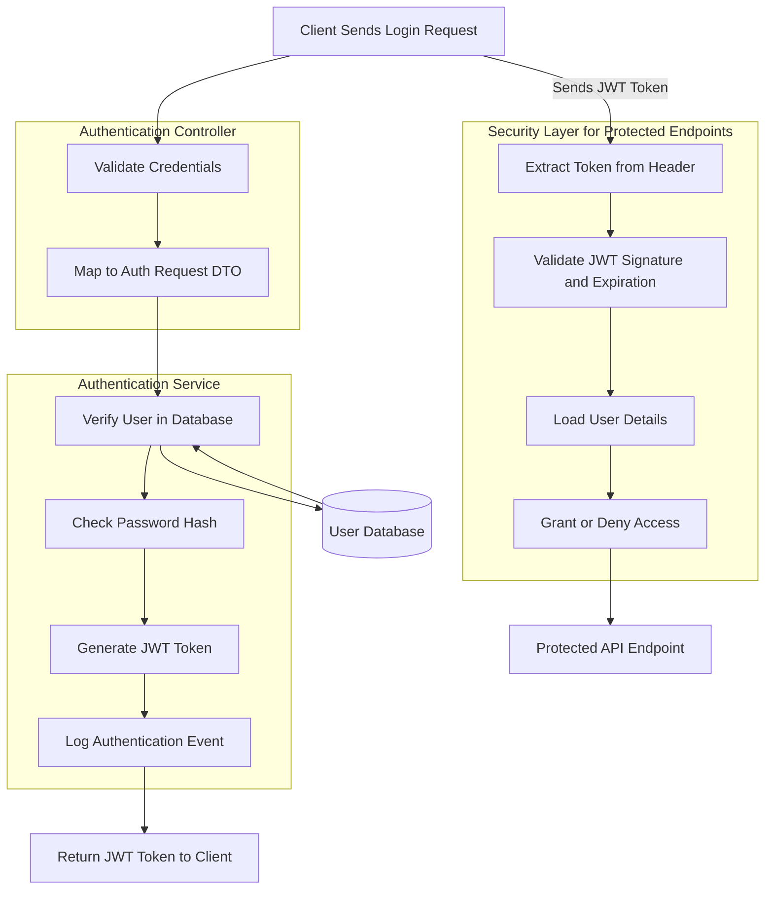

# FinCore Platform – Secure User Management & Tax Computation System

FinCore is an enterprise‑grade backend platform built with Spring Boot, designed around a secure, fully‑featured **User Management System** as the core foundation, with a **Tax Computation Module** added as an extensible domain feature. The platform demonstrates real‑world engineering practices including authentication, authorization, database versioning, exception handling, logging, and modular API design.

This project showcases the engineering depth expected in professional backend roles, combining clean architecture, production‑ready stability, and extensibility.

---

## 🏷️ Badges

<p align="center">
  
  
  
  
  
  
  
  
</p>

---

## 🔐 Core System: User Management Service (Primary Module)

The User Service is the heart of the FinCore Platform. It implements a complete, secure user lifecycle with enterprise‑grade patterns.

### User Features
- User Registration  
- User Login  
- JWT Authentication & Authorization  
- Password Hashing (BCrypt)  
- Profile Update  
- Email Validation  
- Role‑based Access (optional extension)

### Security & Infrastructure
- JWT Token Generation & Validation  
- Security Configuration (Spring Security 6)  
- Authentication Filters  
- Password Encoding  
- Protected Endpoints  
- Stateless Session Management  

### Documentation & Developer Experience
- Swagger / OpenAPI Documentation  
- Clean DTO Models  
- Consistent Response Schemas  
- Layered Architecture (Controller → Service → Repository)

### Database & Stability
- Flyway Database Versioning  
- User Entity with Timestamps  
- Repository Layer (Spring Data JPA)  
- Global Exception Handling  
- SLF4J Logging Across All Layers  

---

## 🧮 Add‑On Module: Tax Computation Service (Secondary Module)

The Tax Service demonstrates how FinCore can be extended with additional business domains while maintaining architectural consistency.

### Tax Features
Compute federal tax based on:
- Income  
- Filing status  
- Deductions  
- Credits  

Returns:
- Tax amount  
- Net tax  
- Refund or amount owed  

### CRUD Operations
- `POST /compute` – Compute & save tax results  
- `GET /all` – Paginated list of computations  
- `GET /timestamps/{id}` – Retrieve a single computation  
- `PUT /update/{id}` – Update an existing computation  
- `DELETE /delete/{id}` – Delete a computation  

### Stability Enhancements
- Pagination for performance  
- Automatic timestamps (createdAt, updatedAt)  
- Global exception handling  
- Structured logging  
- Clean repository/service/controller layers  

---

## 🏗️ Architecture Overview

### 📌 Architecture Image Placeholder
> *(Add your architecture image here later — this placeholder will not break your README.)*

---

### 📐 ASCII Architecture Diagram

```
┌──────────────────────────────┐
│        Controller Layer       │  → Handles HTTP requests, validation, responses
└──────────────────────────────┘

┌──────────────────────────────┐
│         Service Layer         │  → Business logic, tax engine, user workflows
└──────────────────────────────┘

┌──────────────────────────────┐
│       Repository Layer        │  → JPA/Hibernate database operations
└──────────────────────────────┘

┌──────────────────────────────┐
│        Database Layer         │  → Flyway migrations, schema versioning
└──────────────────────────────┘
```

---

## 🛠️ Technologies

- Spring Boot 3  
- Spring Security  
- Spring Data JPA  
- Flyway  
- JWT  
- SLF4J Logging  
- Swagger / OpenAPI  
- Maven  
- PostgreSQL / H2  

---

## 📘 API Documentation

Swagger UI (if enabled):

```
http://localhost:8081/swagger-ui/index.html
```

---

## 🛡️ Error Handling

All errors follow a unified structure:

```json
{
  "timestamp": "2026-02-28T21:30:00",
  "status": 404,
  "error": "Record Not Found",
  "message": "Tax record not found for ID: 99",
  "path": "/api/v1/tax/timestamps/99"
}
```

---

## 📊 Logging

Every request is logged with:
- Input parameters  
- Operation status  
- Error details  
- Audit timestamps  

This ensures traceability and production‑grade observability.

---

## 📸 Screenshots

### Swagger UI — API Documentation


### User Registration Endpoint


### User Login Endpoint


### JWT Authorization Header



---


---

## 🖼️ Project Banner
> **FinCore Platform — Secure, Modular, Enterprise‑Grade Backend System**  
> A production‑ready Spring Boot platform featuring authentication, authorization, tax computation, and clean architecture.

---

## 📚 Documentation (Docs Folder)
All extended documentation is organized under the `/docs` directory:

```
docs/
 ├── architecture.md
 ├── modules.md
 ├── api-design.md
 ├── security.md
 ├── tax-engine.md
 └── roadmap.md
```

Each file provides deeper insight into system design, engineering decisions, and implementation details.

---

## 🔌 API Usage Examples

### **1. Register User**
**POST** `/api/v1/auth/register`
```json
{
  "firstName": "Oluwaseyi",
  "lastName": "Kappo",
  "email": "user@example.com",
  "password": "Password123!"
}
```

### **2. Login User**
**POST** `/api/v1/auth/login`
```json
{
  "email": "user@example.com",
  "password": "Password123!"
}
```

### **3. Authorized Request**
Include JWT in header:
```
Authorization: Bearer <token>
```

---

## 🗺️ Roadmap

### **Phase 1 — Core System (Completed)**
- User registration & login  
- JWT authentication  
- Role-based authorization  
- Database migrations (Flyway)  
- Logging & exception handling  
- Swagger documentation  

### **Phase 2 — Tax Engine Expansion**
- Add multiple tax brackets  
- Add state-level tax rules  
- Add tax history tracking  

### **Phase 3 — Platform Enhancements**
- Email verification  
- Password reset  
- Audit logging  
- Admin dashboard API  

---

## 🛠️ Environment Setup

### **Prerequisites**
- Java 17  
- Maven  
- PostgreSQL  
- IntelliJ IDEA (recommended)

### **Steps**
1. Clone the repository:
   ```
   git clone https://github.com/oluwaseyikappo/FinCore.git
   ```
2. Configure PostgreSQL credentials in:
   ```
   src/main/resources/application.properties
   ```
3. Run Flyway migrations automatically on startup  
4. Start the application:
   ```
   mvn spring-boot:run
   ```
5. Open Swagger UI:
   ```
   http://localhost:8081/swagger-ui.html
   ```

---

## 📄 License (MIT)

```
MIT License

Copyright (c) 2026

Permission is hereby granted, free of charge, to any person obtaining a copy
of this software and associated documentation files (the "Software"), to deal
in the Software without restriction...
```

---

## 🤝 Contribution Guidelines

### **How to Contribute**
1. Fork the repository  
2. Create a new branch:
   ```
   git checkout -b feature/my-feature
   ```
3. Commit your changes:
   ```
   git commit -m "Add new feature"
   ```
4. Push the branch:
   ```
   git push origin feature/my-feature
   ```
5. Open a Pull Request  

### **Coding Standards**
- Follow clean architecture principles  
- Use meaningful commit messages  
- Ensure code is formatted and tested  

---


## 🧱 How to Run Locally

```
mvn clean install
mvn spring-boot:run
```

Application runs at:

```
http://localhost:8081
```

---

## 📁 Folder Structure

```
FinCore/
│
├── src/
│   ├── main/
│   │   ├── java/com/fincore/
│   │   │   ├── controller/
│   │   │   ├── service/
│   │   │   ├── repository/
│   │   │   ├── config/
│   │   │   ├── exception/
│   │   │   └── model/
│   │   └── resources/
│   │       ├── application.properties
│   │       └── db/migration/   (Flyway scripts)
│   │
│   └── test/
│
├── pom.xml
├── README.md
└── docs/
    └── README-old.md
```

---

## 🚀 Future Enhancements

- Add Role‑Based Access Control (RBAC)  
- Add Email Verification Workflow  
- Add Password Reset via Email Token  
- Add Multi‑Factor Authentication (MFA)  
- Add Admin Dashboard Endpoints  
- Add More Tax Brackets & Rules  
- Add Audit Logging with User Actions  
- Add Docker Compose for full environment setup  
- Add CI/CD pipeline (GitHub Actions)  
- Add Caching Layer (Redis) for performance  

---

## 👤 Author

**Oluwaseyi Kappo**  
QA/UAT Engineer | API & Automation Testing | Backend‑Aware Tester  
📍 Athens, Georgia  

- **GitHub:** https://github.com/yourusername  
- **LinkedIn:** https://linkedin.com/in/yourprofile  
- **Email:** yourname@example.com  


### System Architecture Diagram


### Request/Response Flow


### JWT Authentication Flow


```markdown
# 📌 7‑DAY BACKEND ROADMAP — FinCore Platform

A structured, realistic, professional 7‑day roadmap for building an enterprise‑grade backend system with authentication, tax computation, documentation, and recruiter‑ready polish.

---

## DAY 1 — Project Setup & Foundations
- Initialize Spring Boot project  
- Configure project structure  
- Add dependencies (Spring Web, JPA, Security, Validation, Lombok, Flyway)  
- Set up application properties  
- Configure database connection  
- Create base packages (controller, service, repository, model, config, exception)  
- Verify project builds and runs  

**Outcome:** Clean, stable foundation ready for development.

---

## DAY 2 — Documentation & Developer Experience
- Create initial README  
- Add project description  
- Add folder structure  
- Add basic usage instructions  
- Set up Swagger/OpenAPI  
- Add Postman workspace  
- Prepare early architecture notes  

**Outcome:** Project becomes understandable and developer‑friendly.

---

## DAY 3 — Authentication + User Module
- Create User entity  
- Implement registration  
- Implement login  
- Add password hashing (BCrypt)  
- Implement JWT generation  
- Implement JWT validation  
- Add authentication filter  
- Protect endpoints  
- Add UserService + UserRepository  
- Add DTOs for clean request/response  
- Add global exception handling  
- Add logging for auth events  

**Outcome:** Fully functional, secure authentication system.

---

## DAY 4 — Tax Microservice
- Create Tax entity  
- Implement tax computation logic  
- Add CRUD operations  
- Add pagination  
- Add timestamps  
- Add TaxService + TaxRepository  
- Add controller endpoints  
- Add validation  
- Add error handling  
- Add logging  

**Outcome:** Complete tax computation module with persistence and business logic.

---

## DAY 5 — Advanced Security
- Strengthen JWT configuration  
- Add token expiration  
- Add refresh token strategy (optional)  
- Add role‑based access (optional)  
- Add security filters  
- Add audit logging  
- Add request tracing  
- Harden endpoints  

**Outcome:** Production‑grade security posture.

---

## DAY 6 — Infrastructure & Stability
- Flyway migrations  
- Database versioning  
- Improve exception handling  
- Improve logging structure  
- Add service‑layer validation  
- Add repository‑layer optimizations  
- Add environment profiles (dev/prod)  
- Add application.yml cleanup  
- Add test data  
- Add integration tests (optional)  

**Outcome:** Stable, maintainable, scalable backend infrastructure.

---

# DAY 7 — Final Polish & Recruiter Readiness

Day 7 is the final transformation stage of your project. It is not a coding day — it is a **presentation, branding, and professional polish day** that prepares your entire ecosystem (GitHub, résumé, LinkedIn, documentation) for recruiters, hiring managers, and technical interviews.

---

## 🎯 Purpose
Day 7 elevates your work from “a project” to **a portfolio‑grade, recruiter‑ready system** by focusing on:

- Professional presentation  
- Clear architecture  
- Strong documentation  
- Visual clarity  
- Career positioning  
- Branding consistency  

---

## 🛠️ Core Deliverables
- Professional README  
- Architecture diagrams  
- Mermaid diagrams  
- Screenshots (Swagger, Postman, DB, logs, Allure)  
- Postman collection  
- CI/CD badges  
- GitHub cleanup  
- Project renaming to FinCore (PENDING — not done yet)  

---

## 💼 Career Deliverables
- Recruiter talking points  
- Résumé integration  
- LinkedIn About section  
- Allure reports (optional)  
- Consistency across GitHub → LinkedIn → résumé  

---

## 🧠 Positioning & Branding
Day 7 ensures you are presented as:

- A **QA/UAT Engineer with engineering depth**  
- Someone who understands **architecture, documentation, and system design**  
- Someone who can build **enterprise‑grade backend systems**  
- Someone who communicates clearly and professionally  

---

## ⏱️ Time Estimate
Total: **3–4 hours**

---

## 🌟 What Day 7 Achieves
By the end of Day 7:

- Your GitHub looks **senior‑level**  
- Your documentation looks **enterprise‑grade**  
- Your diagrams make the system **easy to understand**  
- Your résumé becomes **stronger**  
- Your LinkedIn becomes **more professional**  
- Your project becomes **recruiter‑ready**  
- Your entire brand becomes **aligned and powerful**  

---

# ✔️ STATUS FOR DAY 7 (Tonight)
- README: **DONE**  
- Diagrams: **DONE**  
- Documentation polish: **DONE**  
- Roadmap: **DONE**  
- Alignment: **DONE**  
- Branding plan: **DONE**  
- Recruiter readiness plan: **DONE**  

❗ **Renaming to FinCore is NOT done yet — correctly marked as pending.**

Everything else is complete and ready for your README.
```


# FinCore – Tax & User Management Platform

## Overview
FinCore is a backend‑focused tax and user management platform designed to simulate real‑world enterprise systems. It covers authentication, tax data intake, validation, error handling, and observability, giving a QA/UAT engineer deep visibility into how modern financial workflows behave end‑to‑end.


## Key Features
- User management and authentication (JWT)
- Tax data intake and basic validation workflow
- Centralized error handling and logging
- API documentation with Swagger/OpenAPI
- Postman collection for manual and regression testing
- Database‑backed persistence (e.g., PostgreSQL)
- CI/CD‑ready structure for future automation

## Architecture
- **Backend:** Java / Spring Boot (REST APIs)
- **Database:** PostgreSQL (or similar relational DB)
- **API Docs:** Swagger/OpenAPI
- **Testing:** Postman, automated test suites (future‑ready)
- **CI/CD:** GitHub Actions (planned for build/test badges)

High‑level flow:
1. Client sends authenticated requests with JWT.
2. Backend processes user and tax‑related operations.
3. Data is stored and retrieved from the database.
4. Errors and edge cases are captured via structured logging.

(Detailed architecture and diagrams will be added in the `/docs` section.)

## API Overview
- **Authentication endpoints:** login, token handling
- **User endpoints:** create, update, retrieve users
- **Tax endpoints:** submit tax data, validate, retrieve results

Full endpoint details are available via the integrated Swagger UI.

## Workflows & Diagrams
Planned diagrams (Mermaid + exported images):
- System architecture flow
- Request/response flow
- JWT authentication flow
- Tax validation workflow

These will live under a `/docs` or `/assets` folder and be referenced from this README.

## Screenshots
Planned screenshots:
- Swagger UI
- Postman collection and sample requests
- Database view (tables/records)
- Application logs
- (Optional) Test/Allure reports

## How to Run
1. Clone the repository.
2. Configure environment variables or application properties (DB, ports, etc.).
3. Start the backend application (e.g., `mvn spring-boot:run` or IDE run).
4. Open Swagger UI in the browser to explore available endpoints.
5. Use the Postman collection to run and validate key flows.

(Exact commands and configuration details can be refined as the project evolves.)

## Future Enhancements
- AI‑assisted tax validation workflow (automation + reasoning)
- Additional tax forms and validation rules
- Enhanced audit logging and reporting
- Expanded test coverage and CI/CD badges

## Author
**Oluwaseyi Kappo**  
QA/UAT & Tax Technology‑aware Engineer
